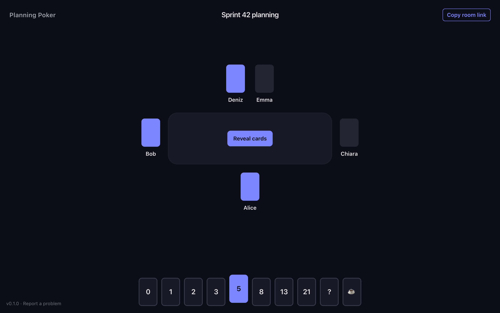
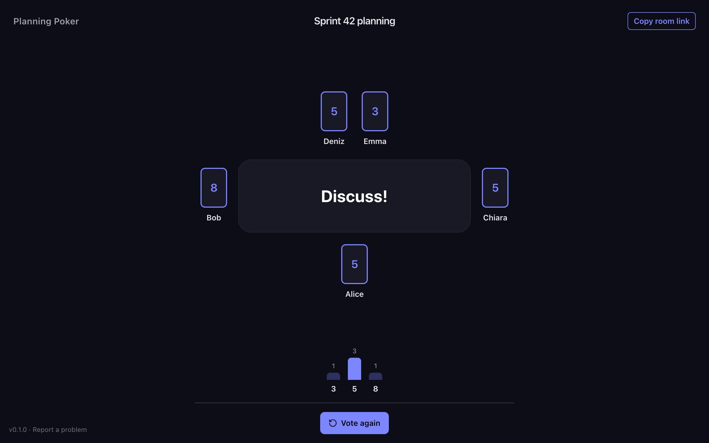
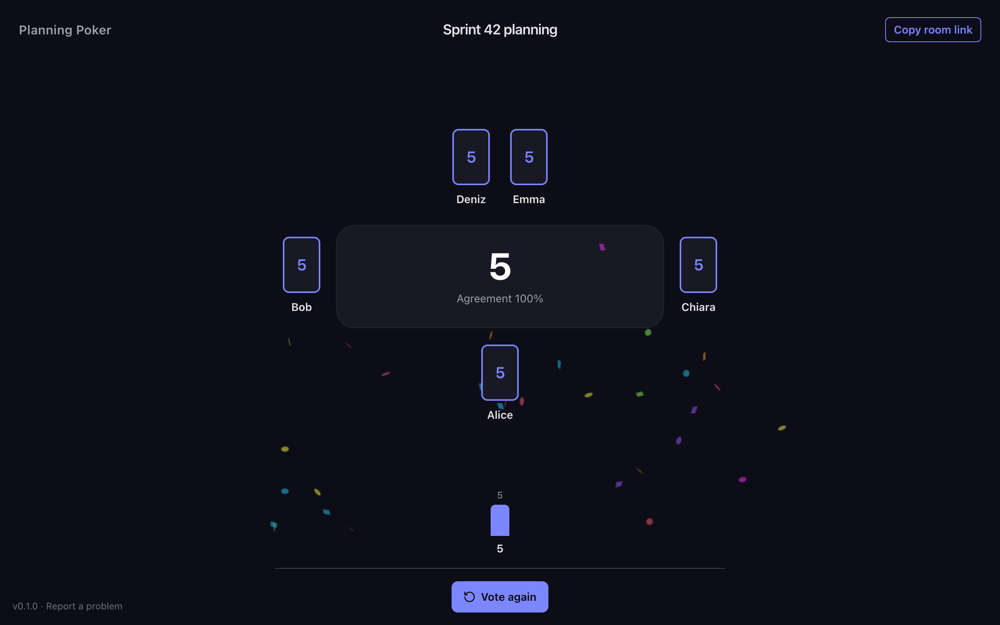

# Planning Poker

Self-hosted planning poker without accounts: create a room, share the link, and start estimating. It ships as one small container, a single binary with no external services and no analytics. Rooms can optionally be kept in SQLite.

| Voting                                                                      | Revealed                                                                               | Consensus                                                            |
| --------------------------------------------------------------------------- | -------------------------------------------------------------------------------------- | -------------------------------------------------------------------- |
|  |  |  |

## Rules

Cards stay hidden until someone reveals them. If the estimates span more than neighbouring cards (for example 3 and 8), or anyone played `?`, the table shows **Discuss!**. Otherwise it proposes the median card with an **agreement** score: every pair of voters on the same card counts 100%, on neighbouring cards 50%, further apart 0%, averaged over all pairs. `☕` asks for a break and is left out of the result.

## Run with Docker

```sh
docker build -t planning-poker https://github.com/lgraubner/planning-poker.git
docker run --rm -p 8080:8080 planning-poker
```

Open <http://localhost:8080>. Rooms live in memory and disappear on restart unless you set `DATABASE_PATH`.

## Run with Docker Compose

This keeps rooms in SQLite on a volume. The image provides `/data`, owned by its non-root user:

```yaml
services:
  planning-poker:
    build: https://github.com/lgraubner/planning-poker.git
    ports: ['8080:8080']
    environment:
      DATABASE_PATH: /data/rooms.db
    volumes: [data:/data]
    restart: unless-stopped
volumes:
  data:
```

```sh
docker compose up -d
```

To update, run `docker compose up -d --build`; it fetches the latest `main`.

## Configuration

| Variable           | Default           | Description                                                                                                                                                                                                                                                        |
| ------------------ | ----------------- | ------------------------------------------------------------------------------------------------------------------------------------------------------------------------------------------------------------------------------------------------------------------ |
| `PORT`             | `8080`            | Listening port.                                                                                                                                                                                                                                                    |
| `DATABASE_PATH`    | unset (in memory) | SQLite file that keeps rooms across restarts. Created if missing; its directory must exist and be writable.                                                                                                                                                        |
| `CLIENT_IP_HEADER` | unset             | Header your reverse proxy sets with the client address, such as `X-Forwarded-For` (last entry is used), so rate limits apply per client instead of to the proxy. Only set it when every request passes through that proxy, because clients can otherwise forge it. |

### SQLite persistence

The database stores room codes, titles, round numbers, and reveal state. Participants and estimates stay in memory, so after a restart people rejoin with empty cards. A bind mount instead of a named volume must be writable by UID 65532.

|                          | In memory | With `DATABASE_PATH` |
| ------------------------ | --------- | -------------------- |
| Rooms survive restarts   | no        | yes                  |
| Empty rooms expire after | 1 hour    | 30 days              |
| Room limit               | 1,000     | 100,000              |

Rooms nobody ever joined expire after ten minutes either way.

### Production

Run exactly one replica: rooms live in that process, so a second one would not see them. Put HTTPS termination in front of it (browsers only allow "Copy room link" on HTTPS or localhost), preserve the public `Host` header, and forward WebSocket upgrades. `/healthz` returns process health. Logs go to stdout and omit room codes, names, titles, and estimates. The distroless image runs as a non-root user.

## Technical overview

A single Go server ([Chi](https://github.com/go-chi/chi) routes, [Coder WebSockets](https://github.com/coder/websocket)) serves a React SPA built with Vite, [TanStack Router](https://tanstack.com/router), and Tailwind CSS. The SPA is embedded into the binary with `go:embed`, so a release is one static executable. Browsers talk to the server over one WebSocket per tab; the server holds room state in memory and optionally persists rooms with pure-Go SQLite ([modernc.org/sqlite](https://gitlab.com/cznic/sqlite)).

`cmd/server` starts the process, `internal/room` owns room state and persistence, `internal/httpserver` exposes HTTP and WebSocket routes, `internal/webui` embeds the build, and `web` contains the SPA. The glossary is in [CONTEXT.md](CONTEXT.md); design decisions are in [docs/adr](docs/adr).

## Development

Requires Go 1.27+, Node.js 24+, npm, and Make.

```sh
make build
./bin/planning-poker
```

For development, run these in separate terminals after the first build:

```sh
make dev-server
make dev-web
```

Open the Vite address printed in the second terminal. Vite proxies HTTP and WebSocket requests to Go on port 8080. Restart Go after backend changes.

### Verify

Install the Playwright browser once with `npx --prefix web playwright install chromium`. Install the Git hooks once with `npx --prefix web lefthook install`; the pre-commit hook formats staged files with Oxfmt and Go files with gofmt. The commit-msg hook requires [Conventional Commits](https://www.conventionalcommits.org/), checked by commitlint; CI also checks every pull request's commits and title (`.github/workflows/commitlint.yml`), since a squash merge uses the title as the commit message. CI still rejects unformatted code, and the project `.editorconfig` keeps formatting independent of personal editor settings.

```sh
make check
make e2e
make smoke
```

`check` runs Oxlint and Oxfmt checks, builds and type-checks the SPA, runs frontend unit tests (Vitest, `web/src/**/*.test.{ts,tsx}`), runs Go vet, runs race-enabled Go tests, and runs the end-to-end tests. `e2e` builds the SPA, starts the real Go server on port 8182, and drives it with Playwright in desktop and mobile Chromium. Run a single test with `npx --prefix web playwright test -c web/playwright.config.ts -g "<name>"`. Use `npm --prefix web run format` to format the repository with Oxfmt (configured in the root `.oxfmtrc.json`). Git-ignored files and `web/package-lock.json` are excluded. `smoke` builds the container, starts it on a temporary loopback port, checks health, embedded HTML, room creation, and that the room survives a restart on a SQLite volume, then removes that test container. It requires Docker and curl. CI runs `check` as parallel web and Go jobs followed by end-to-end tests (`.github/workflows/ci.yml`), and runs the container smoke test on every push to `main` and on pull requests that change the image inputs (`.github/workflows/docker.yml`).
